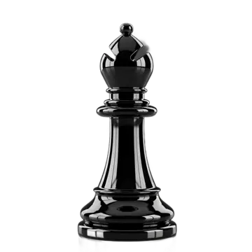
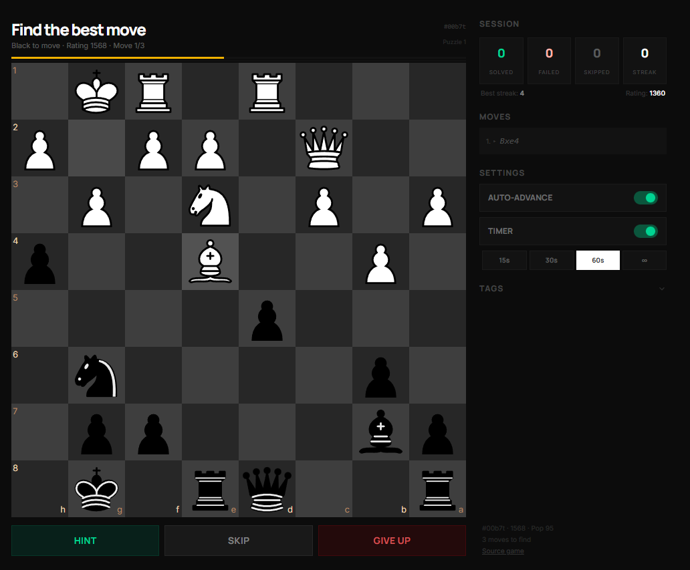

<h1 align="center">
  <br/>
  oChess
</h1>

<p align="center">
  A modern chess-first platform for play, analysis, puzzles, and long-term improvement.
</p>

<p align="center">
  <a href="https://github.com/Ijtihed/oChess/actions"></a>
  <a href="LICENSE"></a>
  
  
  
</p>

<p align="center">
  
  
  
  
  
</p>

<p align="center">
  
</p>

---

# Wait, Another Chess Platform?

<table>
<tr>
<td width="68%" valign="top">
  <p><strong>Yes, and intentionally so.</strong></p>
  <p><strong>oChess</strong> is built around one core idea: the game should not end when the clock hits zero.<br />
  Most platforms let your mistakes disappear into history; oChess turns them into a learning loop.</p>
  <p>From fast play and bots to analysis, review, and coaching, every feature is designed to feel:</p>
  <ul>
    <li>simple</li>
    <li>premium</li>
    <li>fast</li>
    <li>user-first</li>
  </ul>
</td>
<td width="32%" align="center" valign="middle">
  
</td>
</tr>
</table>

## What Makes oChess Different

### The post-game loop is the product

After a game, you should be able to move straight into:
- mistake review
- plain-language coach feedback
- puzzle generation from your errors
- study/review material for spaced repetition (Anki!)
- plain language game-rule generation
- anki-style repeatition based on your puzzles/games

This is the core experience.

### What is special here

- **Anki-style chess memory loop**: important positions become review cards with spaced repetition so that your mistakes do not disappear after one game.
- **LLM game-rule generation**: write rules in plain language, generate playable variants, and test them quickly.
- **Play those variants with friends**: generated rules are not just text; they are meant to be played in social games and challenges.
- **Chess-first UX**: no feed clutter, no content bloat, just simple board and progression.

## Product Surfaces

## Tech Stack

| Layer | Tech |
|-------|------|
| Framework | React 19, Vite 8 |
| Styling | Tailwind CSS v4 |
| Routing | React Router v7 |
| Chess logic | chess.js |
| Board UI | react-chessboard |
| Weak bots | js-chess-engine (Web Worker) |
| Strong bots + analysis | Stockfish 18 WASM |
| Spaced repetition | SM-2 engine (custom) |
| Testing | Vitest, @testing-library/react |
| CI/CD | GitHub Actions |

## Setup

### Requirements
- Node.js `20+`
- npm `10+`

### Run locally

```bash
cd ochess-app
npm install
npm run dev
```

### Production build

```bash
cd ochess-app
npm run build
npm run preview
```

## Project Structure

- `ochess-app/` - frontend app
- `docs/` - product and architecture notes
- `.github/` - CI and contribution workflows

## Roadmap Direction

- Stronger game-to-review automation
- Better player profiling and progression
- More polished analysis and study flows
- Collaboration-friendly chess tooling

## Contributing

Contributions are welcome.

1. Fork the repository
2. Create a branch (`git checkout -b feature/your-feature`)
3. Commit your changes
4. Open a PR

Read `CONTRIBUTING.md` for full guidelines.

## Security

Please follow `SECURITY.md` for responsible vulnerability reporting.

## License

Licensed under `Apache-2.0`.  
See `LICENSE` and `NOTICE`.

Reuse is free, including commercial use, as long as license/attribution notices are preserved.

---

<div align="center">
  <p>Made with intent by <strong>Ijtihed</strong></p>
  <p><em>Chess-first. Quietly premium.</em></p>
</div>
